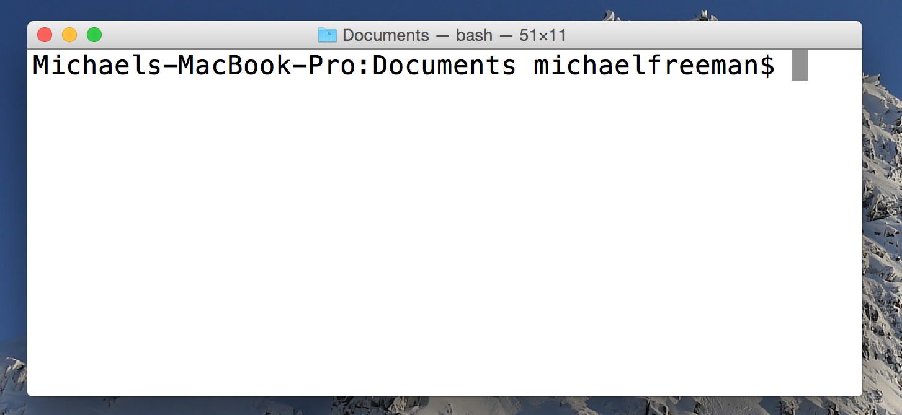
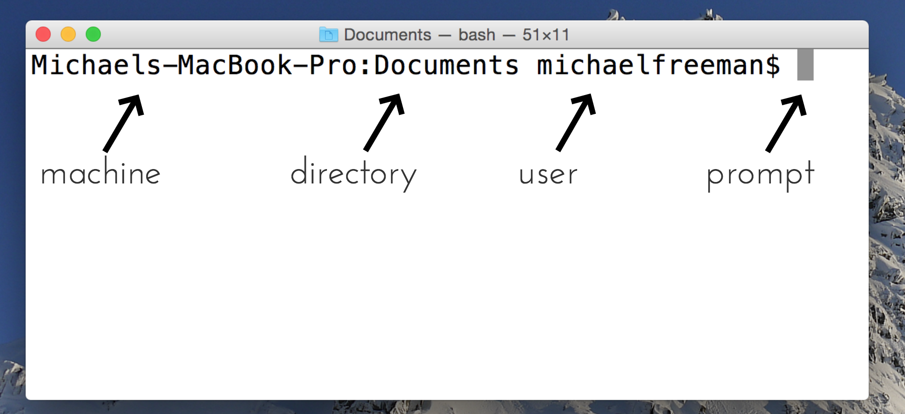
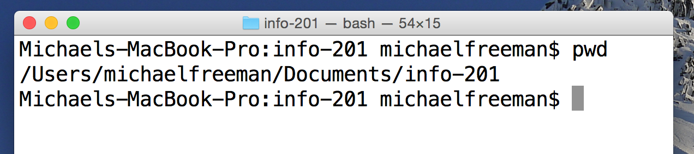

# Module 2: Introduction to the Command Line

## Overview
The command-line, or "terminal", is a simple text-based interface for providing instructions to your computer. Familiarizing yourself with a few pieces of simple syntax will allow you to efficiently perform a variety of tasks. In this course, we'll only scratch the surface of using the command-line, as it's primary purpose is to provide us with an interface for keeping track of our code. In this module, we'll cover elementary tasks, including navigating a file-system and managing files. Note, some commands may differ for Windows.

<!-- START doctoc generated TOC please keep comment here to allow auto update -->
<!-- DON'T EDIT THIS SECTION, INSTEAD RE-RUN doctoc TO UPDATE -->
**Contents**

- [Resources](#resources)
- [File System Structure](#file-system-structure)
- [Accessing the Terminal](#accessing-the-terminal)
- [Navigating the file system](#navigating-the-file-system)
  - [Printing your Working Directory](#printing-your-working-directory)
  - [Changing Directories](#changing-directories)
  - [File Management](#file-management)

<!-- END doctoc generated TOC please keep comment here to allow auto update -->

## Resources
- [Codecademny Exercises](https://www.codecademy.com/en/courses/learn-the-command-line/lessons/navigation/exercises/your-first-command)
- [Terminal Commands](http://www.lagmonster.org/docs/unix/intro-137.html)

## File System Structure
Before exploring the syntax for navigating a file system, it's important to understand how it's organized. If you haven't considered it before, the files on your computer are organized into a hierarchical tree-like structure of folders (directories). Here is an example structure for a Mac machine:


_[source](http://korflab.ucdavis.edu/Unix_and_Perl/unix_and_perl_v3.0.html)_

Given this structure, you can go further down a branch, or you can move up a level in the hierarchy. For example, to move from the `Mac` directory to the `Docs` directory, you would first have to go up to the `Volumes` directory, then into the `USB` directory, then into the `Unix...` directory in order to reach your desired set of files/folders.

## Accessing the Terminal
Opening your command-line will differ based on your operating system, as well as your preferred terminal program (for Windows). On a Windows machine, you should be able to access the Git Bash program from your Start Menu or Desktop icon. On a Mac, the simplest way to open up the terminal is via the Spotlight Search. First, open the Spotlight Search by holding the `command` key and hitting the `spacebar`. This should bring up the following searchbar:


When the Spotlight Search opens, simply begin typing `terminal`, and hit `enter` when the `terminal` icon appears.

Once you've opened the terminal, you'll have a simple (yet informative) text-based interface that should look like this:



Despite being terse, there's actually quite a bit of information in this image, including:

- The **machine** that is being used (this may seem silly, but you can connect to other machines and access their terminals, so this turns out to be rather important)
- The current **directory** name (though the full path to that directory is not shown)
- The current **user**, who will have a certain set of priviliages/abilities depending on the configuration of the machine
- A **prompt** (i.e., the `$`), that indicates that the terminal is ready to accept text instructions



You should now feel comfortable with the idea of how files are organized, and be able to open your command-line. In the following section, we'll cover some introductory commands that you can begin to use.

## Navigating the file system
The ability to provide instructions directly computer is quite powerful, so much so that you [delete your entire company](http://www.independent.co.uk/life-style/gadgets-and-tech/news/man-accidentally-deletes-his-entire-company-with-one-line-of-bad-code-a6984256.html) in six characters. In this section, we'll introduce some basic syntax for file management.

### Printing your Working Directory
First, you need to know that you're actually operating at a specific location in your file structure when you're using the terminal. This makes sense, because if we want to do something like create a file, your terminal needs to know where to put it. In order to figure out where you are in your file system, you use the `pwd` command, which stands for _print working directory_:



Before we ran the `pwd` command, we knew that we were in a directory called `info-201`. However, we were unaware of where that directory lived within the context of the entire system. You'll frequently find yourself typing `pwd` to check where you are, and the results of that command is for your terminal to print your current location.

### Changing Directories
If you want to change your directory, you use the `cd` command, which abbreviates _change directory_. While the use of the command is simple, it's important to note that you can provide **absolute** or **relative** filepaths. For example, you could change to a new directory `info-474` using the following command:

```bash
# Navigate from the root of the file system
$ cd /Users/michaelfreeman/Documents/info-474
```
Because you start at the root of your file system with the first forward slash (`/`), you are providing the full, or absolute filepath. However, you can also navigate from your current location.

```bash
# Navigate to the Documents directory using an absolute path
$ cd /Users/michaelfreeman/Documents
# Navigate into the info-474 directory using a relative path
$ cd info-474
```
Here are two tricks that will save you a lot of time. First, you can navigate up a directory in the hierarchy by using `..`.

```bash
# Navigate up one directory
cd ..
```

You can also use the `..` syntax in conjunction with other file information. For example, given a `Documents` folder with two sub-directories `info-474` and `info-201`, we could navigate from _inside_ the `info-474` directory into the `info-201` directory in a single line of code:
```bash
# Navigate from inside `info-474` into `info-201`
cd ../info-201
```

Second, you can use the tilde (`~`) as shorthand for the home directory of the current user. This will likely direct you to `/users/USERNAME`. As you would expect, you can use the tilde as part of a full filepath as follows:

```bash
# Navigate to the Documents folder inside of the home directory
cd ~/Documents
```

Also, you can always hit **tab to auto-complete**, which will save lots of time!

### File Management
Once you are inside of a directory, it's useful to be able to interact with files. Here is a sample of common tasks you may want to perform, though there are [many more](http://www.lagmonster.org/docs/unix/intro-137.html).

| Action | Syntax	|
| ------------- |  ------------- |
| List contents (files, folders) in a directory	| `ls`	|
| Copy a file	| `cp OLD_FILE NEW_FILE`	|
| Move a file	| `mv OLD_FILE NEW_FILE`	|
| Delete a file	(careful!)| `rm FILE_NAME`	|
| Create a new file ([windows alternative](http://superuser.com/questions/502374/equivalent-of-linux-touch-to-create-an-empty-file-with-powershell))	| `touch FILE_NAME`	|
| Open a file	| `open FILENAME` (windows: `start FILENAME`)	|
| View text of a file | `less FILE_NAME`	|
| See previous commands executed | `history` (also hit up arrow)	|
| View Manual information for a command | `man COMMAND`	|

Don't hesitate to experiment with these commands, though I suggest making files to experiment moving/deleting/etc. Google is obviously a great resource, as is the `man` command for reading the manual (though that can be a bit dense). To practice using basic command-line syntax, see [exercise-1](exercise-1).
